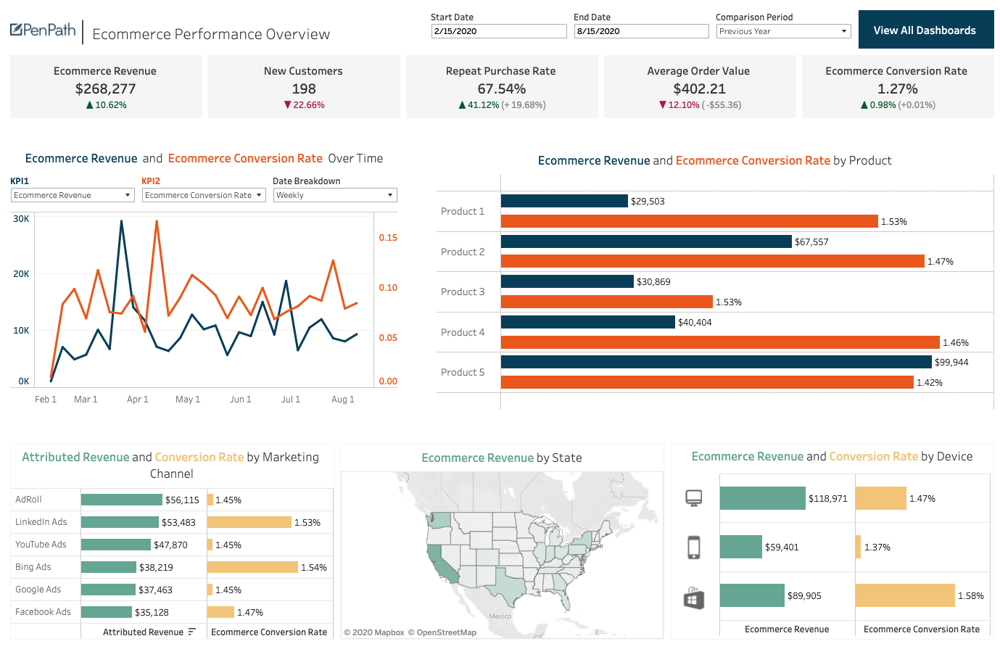

# 👨‍💻 Aditya Bajaj — Software Developer

Welcome to my portfolio! I'm a passionate full-stack developer with experience building scalable web applications, automating workflows, and deploying robust backend systems. I love turning ideas into reality using technology.

---

## 🔍 About Me

I'm a self-driven developer currently exploring cloud-native architectures and DevOps practices. I have a strong foundation in **Java**, **Python**, and **JavaScript**, with a deep interest in backend engineering, system design, and automation. In my free time, I contribute to open-source projects and write technical blogs.

---

## 🛠️ Skills

### Programming Languages:
- Java
- Python
- JavaScript (ES6+)
- SQL

### Web Technologies:
- HTML5, CSS3, Bootstrap
- React.js
- Node.js, Express

### Tools & Platforms:
- Git & GitHub
- Docker & Kubernetes
- AWS (EC2, S3, Lambda)
- MySQL, MongoDB
- Jenkins, GitHub Actions

---

## 📂 Projects

### 🚀 Smart Cart Checkout System

> An automated cart billing system using RFID, weight, and IR sensors to detect and bill items in real-time.

- Built a sensor-based system that tracks items placed in the cart.
- Real-time billing dashboard with REST API using **Spring Boot**.
- Data logged and visualized using **Grafana**.

---

### 🔐 Face & OTP-Based Two-Factor Authentication

> Developed a 2FA login system using face recognition and email OTP verification.

- Trained facial recognition model with OpenCV.
- Used **Firebase** for OTP verification and push notifications.
- Implemented image storage and admin alerting via FCM.

---

### 📊 E-Commerce Analytics Dashboard

> Built an interactive dashboard for tracking user behavior, conversions, and product performance.

- Built with **React.js**, **Chart.js**, and **Flask backend**.
- Integrated with **Google Analytics API** and internal APIs.
- Role-based access and dynamic theming.

---

## 📈 GitHub Stats

---

## 🏆 Achievements

- 🥇 Winner — VIT Hackathon 2024 (Built a full-stack AI scheduling app)
- 🥈 Finalist — Smart India Hackathon (SIH)
- 👨‍🏫 Hosted Git/GitHub workshops for over 100+ students
- ⭐ Contributed to 5+ open source repositories

---

## 📫 Contact Me

Feel free to reach out via:

- 📧 Email: [you@example.com](bajajadi7@gmail.com)
- 💼 LinkedIn: [linkedin.com/in/yourprofile](https://www.linkedin.com/in/aditya-bajaj-18a14327a/)
- 🌐 Portfolio Website: [yourwebsite.com](https://adityabajajadi.github.io/hacker/)

---

## 💬 Quote

> _"Code is like humor. When you have to explain it, it’s bad."_  
> — Cory House

--- 

## 📝 Blog

- [Understanding Microservices Architecture](https://yourblog.com/microservices-architecture)
- [Building Scalable Web Applications](https://yourblog.com/scalable-web-apps)
- [DevOps Best Practices](https://yourblog.com/devops-best-practices)
- [Automating CI/CD Pipelines](https://yourblog.com/ci-cd-automation)
- [Exploring Cloud-Native Development](https://yourblog.com/cloud-native-development)

---

## My Dev Setup

---